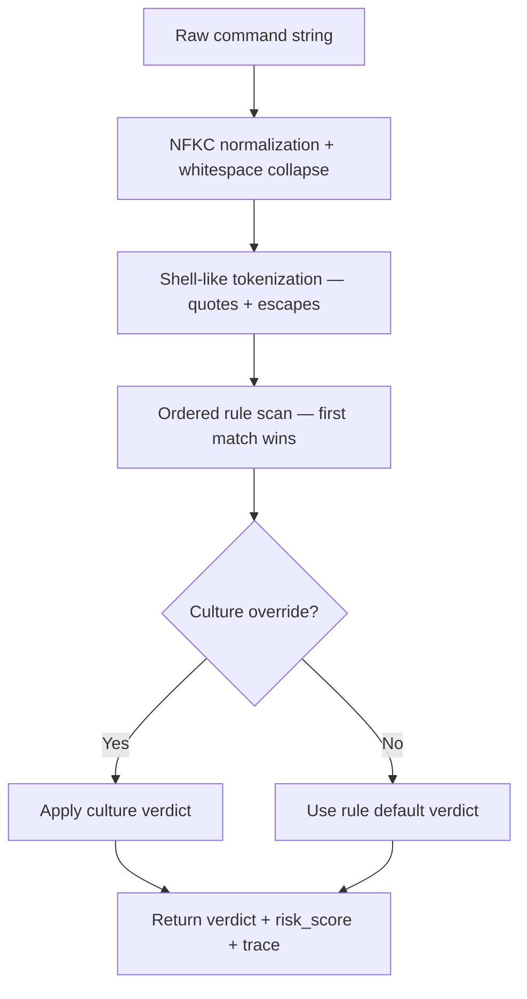

# Intentra command guard — policy engine deep dive

The guard engine intercepts destructive shell commands before they execute, using a multi-stage pipeline: normalize, tokenize, match, and apply culture overrides. This document covers the architecture, rule registry, and culture integration.

## Pipeline stages



### Stage 1: Normalization

Unicode **NFKC** normalization strips homoglyphs and compatibility characters. Whitespace is collapsed to single spaces. This prevents evasion via unusual Unicode or extra whitespace.

**Implementation:** `normalizeCommand()` in [`guard-command.ts`](../mobile-app/server/guard-command.ts).

### Stage 2: Tokenization

A shell-aware tokenizer splits the normalized string into tokens, respecting:
- Single and double quotes (`'quoted arg'`, `"quoted arg"`)
- Basic backslash escapes (`\ `)
- Multi-word arguments as single tokens

This is intentionally not a full shell parser — no command substitution, no variable expansion. The goal is accurate token boundaries for pattern matching, not shell execution.

**Implementation:** `tokenize()` in [`guard-command.ts`](../mobile-app/server/guard-command.ts).

### Stage 3: Rule matching

Rules are stored in an ordered registry. The engine scans top to bottom and returns the **first matching rule**. Order matters: `rm -rf` is checked before `git` patterns.

**Implementation:** `findFirstMatchingRule()` in [`guard-policy.ts`](../mobile-app/server/guard-policy.ts).

### Stage 4: Culture overrides

If `culture.json` contains an `intentra.risk_gates` section, the engine checks for a key matching the rule's `id`. The culture value overrides the rule's `defaultVerdict`.

Unknown keys in `risk_gates` produce `culture_warnings` in the response — catches typos and drift between policy and culture.

**Implementation:** `evaluateCommandGuard()` in [`guard.ts`](../mobile-app/server/guard.ts).

## Rule registry

Each rule has:

| Field | Type | Description |
|-------|------|-------------|
| `id` | `string` | Unique identifier (matches `intentra.risk_gates` keys) |
| `category` | `filesystem` \| `vcs` \| `sql` \| `container` \| `orchestration` | Grouping |
| `defaultVerdict` | `allow` \| `warn` \| `deny` | Verdict when culture doesn't override |
| `baseRisk` | `0–100` | Intrinsic severity for scoring |
| `description` | `string` | Human-readable explanation |
| `cweHints` | `string[]?` | Documentation-only CWE references |
| `match` | function | Pattern matcher against `CommandContext` |

### Current rules (engine v2)

| Rule ID | Category | Risk | Default | What it catches |
|---------|----------|------|---------|----------------|
| `rm_recursive` | filesystem | 88 | deny | `rm -rf` outside safe artifact dirs (node_modules, dist, etc.) |
| `drop_table` | sql | 92 | deny | `DROP TABLE` / `DROP DATABASE` |
| `truncate` | sql | 85 | deny | `TRUNCATE` (bulk row wipe) |
| `git_force_push` | vcs | 82 | deny | `git push --force` / `git push -f` |
| `git_reset_hard` | vcs | 78 | deny | `git reset --hard` |
| `git_discard` | vcs | 72 | deny | `git checkout .` / `git restore .` |
| `kubectl_delete` | orchestration | 80 | deny | `kubectl delete` |
| `docker_destructive` | container | 75 | deny | `docker rm -f` / `docker system prune` |

### Safe-target allowlist

The `rm_recursive` rule has a built-in allowlist for common build artifact directories: `node_modules`, `.next`, `dist`, `__pycache__`, `.cache`, `build`, `.turbo`, `coverage`. Removing these directories will not trigger the guard.

## Culture integration

Culture overrides are configured in `culture.json` under the `intentra.risk_gates` key:

```json
{
  "intentra": {
    "risk_gates": {
      "git_force_push": "deny",
      "rm_recursive": "deny",
      "kubectl_delete": "warn",
      "docker_destructive": "warn"
    }
  }
}
```

Values must be `"allow"`, `"warn"`, or `"deny"`. Keys must match rule IDs from the registry. Unknown keys produce warnings.

**JSON Schema:** Available at `GET /intentra/guard/schema` and [`schemas/culture-intentra.fragment.json`](../mobile-app/server/schemas/culture-intentra.fragment.json).

## HTTP API

### Evaluate a command

```bash
curl -s -X POST http://localhost:7891/intentra/guard \
  -H "Content-Type: application/json" \
  -d '{"command": "git push --force origin main"}'
```

Response:
```json
{
  "verdict": "deny",
  "pattern": "git_force_push",
  "message": "Blocked: Git force-push (history rewrite on remote).",
  "source": "intentra_guard",
  "rule": { "id": "git_force_push", "category": "vcs", "baseRisk": 82 },
  "risk_score": 82
}
```

### Debug trace

Add `"debug": true` to the request body (or set header `X-Intentra-Guard-Debug: 1`):

```json
{
  "command": "ls -la",
  "debug": true
}
```

Response includes `trace` — ordered array of pipeline steps showing which rules were checked and why they matched or skipped.

### Introspection

- `GET /intentra/guard/rules` — full rule registry (metadata only, no match functions)
- `GET /intentra/guard/schema` — JSON Schema fragment for `intentra.risk_gates` + rule IDs + engine version

## Telemetry

On `deny` or `warn` verdicts:
1. **JSONL append:** `.intentra/telemetry/intentra-guard.jsonl` (gitignored at runtime)
2. **SSE event:** `hook_fire` with `upstream_kind: intentra_guard`, streamed to mobile

This means guard activations appear in the mobile feed alongside agent events.

## Roadmap

Full shell grammar (AST), SQL AST parsing, and signed policy bundles are documented as future work. The current regex + tokenizer model is sufficient for the common destructive patterns targeted today.
