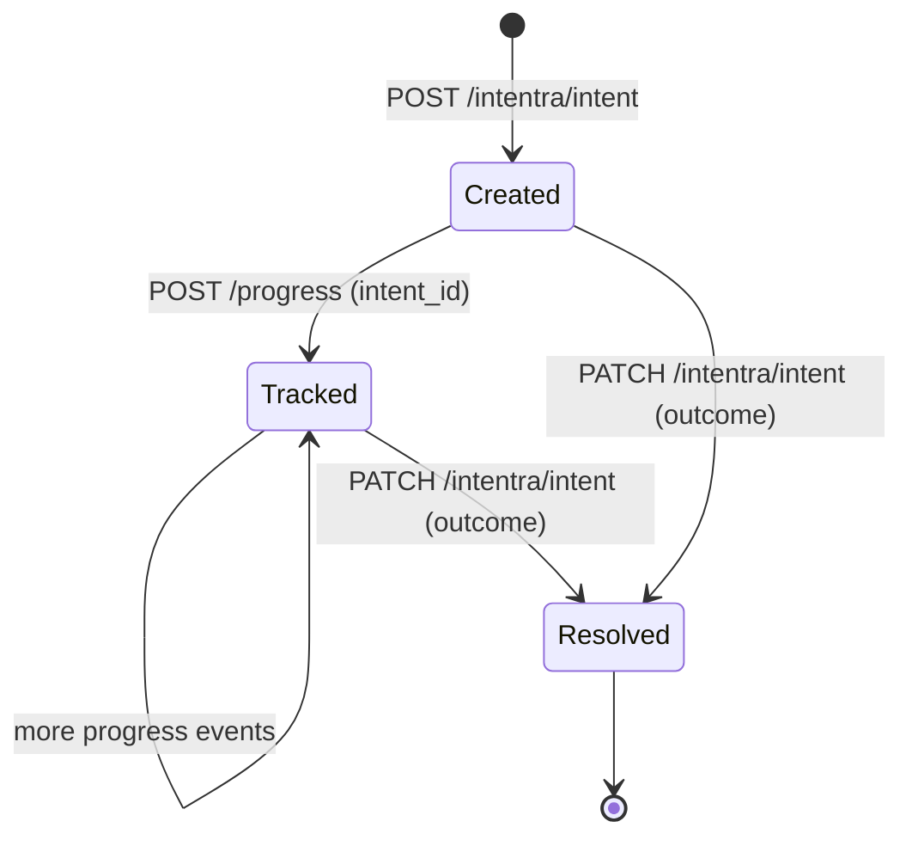

# Intent lifecycle — create, track, resolve

Every agent action in Intentra starts with an **intent**: a structured JSON artifact that captures the prompt, constraints, repo context, and execution plan. This document walks through the full lifecycle.

## Overview



| Phase | HTTP | What happens |
|-------|------|-------------|
| **Create** | `POST /intentra/intent` | Server writes `.intentra/{intent_id}.json`, emits SSE `intent_created` event |
| **Track** | `POST /progress` with `intent_id` | Progress events link to the intent; mobile can filter the live feed by intent |
| **Query** | `GET /intentra/intent/{id}` | Fetch a single artifact by id |
| **List** | `GET /intentra/intents` | List all intent artifacts chronologically |
| **Resolve** | `PATCH /intentra/intent` | Set outcome (`success`, `error`, `cancelled`), emits SSE `intent_resolved` event |

## 1. Create an intent

```bash
curl -s -X POST http://localhost:7891/intentra/intent \
  -H "Content-Type: application/json" \
  -d '{
    "prompt": "Merge feature branch safely, prefer stability, run tests.",
    "repo": { "path": "/path/to/repo", "branch": "feature/x" },
    "constraints": {
      "risk_tolerance": "low",
      "requires_approval_for": ["force_push", "prod_config_change"]
    },
    "plan": [
      { "type": "git_fetch" },
      { "type": "git_merge", "strategy": "safe" },
      { "type": "run_tests", "command": "bun test" }
    ]
  }'
```

**Response** (201):
```json
{
  "intent_id": "intent_2026-03-29T10:00:00Z",
  "prompt": "Merge feature branch safely, prefer stability, run tests.",
  "repo": { "path": "/path/to/repo", "branch": "feature/x" },
  "constraints": { "risk_tolerance": "low", "requires_approval_for": ["force_push", "prod_config_change"] },
  "culture_ref": "/Users/you/.gstack/culture.json",
  "plan": [
    { "type": "git_fetch" },
    { "type": "git_merge", "strategy": "safe" },
    { "type": "run_tests", "command": "bun test" }
  ],
  "outcome": null
}
```

**Side effects:**
- File written to `.intentra/intent_2026-03-29T10:00:00Z.json`
- SSE event emitted with `upstream_kind: intent_created`
- If `culture_ref` is omitted and `~/.gstack/culture.json` exists, auto-linked

## 2. Track progress against the intent

Link progress events to the intent using `intent_id`:

```bash
curl -s -X POST http://localhost:7891/progress \
  -H "Content-Type: application/json" \
  -d '{
    "kind": "progress",
    "message": "Tests passed (42/42)",
    "step": "run_tests",
    "pct": 100,
    "intent_id": "intent_2026-03-29T10:00:00Z"
  }'
```

Or via the CLI helper:

```bash
gstack-progress --message "Tests passed" --step run_tests --pct 100 \
  --intent-id "intent_2026-03-29T10:00:00Z"
```

**Mobile:** The Dashboard screen shows intent filter chips. Tap an intent to see only events linked to that intent via `intent_id`.

## 3. Query intents

**Single intent:**
```bash
curl -s http://localhost:7891/intentra/intent/intent_2026-03-29T10:00:00Z
```

**All intents:**
```bash
curl -s http://localhost:7891/intentra/intents
# → { "intents": [...], "count": N }
```

## 4. Resolve the intent

When work is complete (or failed, or abandoned):

```bash
curl -s -X PATCH http://localhost:7891/intentra/intent \
  -H "Content-Type: application/json" \
  -d '{
    "intent_id": "intent_2026-03-29T10:00:00Z",
    "outcome": "success"
  }'
```

Valid outcomes: `success`, `error`, `cancelled`.

**Side effects:**
- JSON file updated on disk with the new outcome
- SSE event emitted with `upstream_kind: intent_resolved`
- Mobile Intent screen shows the resolved state with color coding

## Relationship to Markdown files

Intent JSON artifacts and the Markdown files (PROMPTS.md, PLANS.md, HANDOFFS.md) serve different purposes:

| | JSON intents | Markdown files |
|---|---|---|
| **Created by** | `POST /intentra/intent` (API) | `/handoff` skill or manual |
| **Format** | Structured, machine-queryable | Prose, human-readable |
| **Scope** | Single task/prompt | Session-level narrative |
| **Lifecycle** | create → track → resolve | Append-only |
| **Best for** | Automation, filtering, audit | Context, decisions, handoffs |

Both live in `.intentra/` and can be committed to git together.

## Cross-session linking

The `intent_id` field creates a cross-cutting link:

1. **Intent artifact** (`.intentra/{id}.json`) — the plan
2. **Progress events** (`POST /progress` with `intent_id`) — what happened
3. **Guard telemetry** (`.intentra/telemetry/intentra-guard.jsonl`) — what was blocked
4. **Mobile feed** (SSE filtered by `intent_id`) — real-time view

This means you can answer: "For intent X, what progress events fired, which guard rules triggered, and what was the outcome?" — all queryable through the API.
