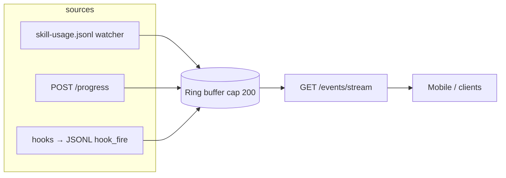
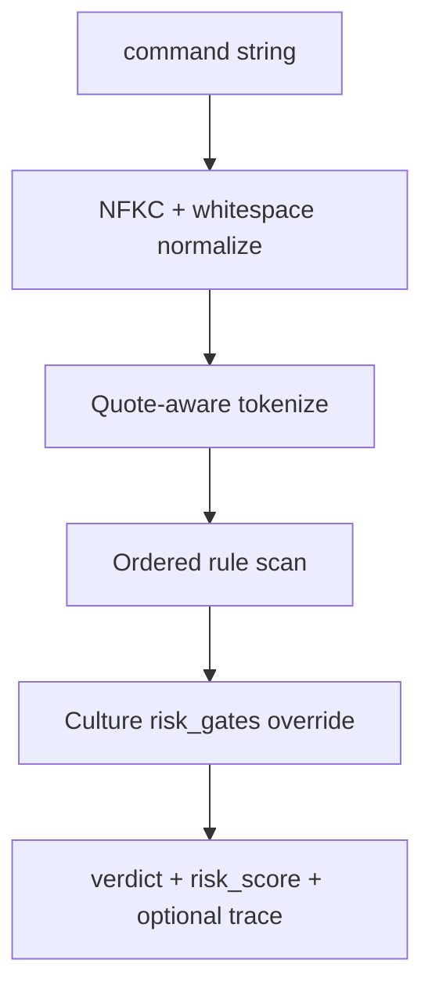

# Intentra progress server — architecture

Single reference for the Bun server in `mobile-app/server/` (port **7891**): event pipeline, guard engine, routes, and auth.

**Related docs:** [Quickstart](quickstart.md) · [API Reference](api-reference.md) · [Intent Lifecycle](intent-lifecycle.md) · [Guard Engine](guard-engine.md) · [Guard Rules Reference](guard-rules-reference.md) · [Culture Config](culture-config.md) · [Error Handling](error-handling.md) · [Troubleshooting](troubleshooting.md) · [Env Reference](env-reference.md) · [Scaling](scaling.md) · [Security](security.md) · [Testing](../mobile-app/TESTING.md) · [Deploy](../DEPLOY.md)

## Event pipeline (JSONL + HTTP → SSE)

- **JSONL:** `GSTACK_STATE_DIR/analytics/skill-usage.jsonl` is watched; relevant lines become `ProgressEvent` rows with `ingest_lane: intentra_jsonl_bridge`.
- **HTTP:** `POST /progress` ingests with `ingest_lane: intentra_http` by default.
- **Buffer:** In-memory ring buffer; `GET /events/history?limit=N` is the REST backfill.
- **SSE:** `GET /events/stream` replays buffer + tracked agents, then live `progress` and `agent_update` / `agent_delete` events.

Implementation: [`mobile-app/server/server.ts`](../mobile-app/server/server.ts).

## Guard pipeline (command → verdict)

- **Registry:** [`guard-policy.ts`](../mobile-app/server/guard-policy.ts) — `GUARD_RULES`, `GUARD_ENGINE_VERSION`, `GUARD_RULE_IDS`.
- **Tokenizer:** [`guard-command.ts`](../mobile-app/server/guard-command.ts).
- **Segmentation:** [`guard-segment.ts`](../mobile-app/server/guard-segment.ts) — split on `&&` / `;` outside quotes before per-segment matching.
- **Facade:** [`guard.ts`](../mobile-app/server/guard.ts) — `evaluateCommandGuard`, telemetry append on deny/warn.

**Culture:** Optional `culture.json` slice `intentra.risk_gates` — keys must match rule ids. JSON Schema fragment: [`mobile-app/server/schemas/culture-intentra.fragment.json`](../mobile-app/server/schemas/culture-intentra.fragment.json). Introspection: `GET /intentra/guard/schema`.

## HTTP route and auth matrix

When **`INTENTRA_TOKEN`** is unset, the server is open. When set, every **POST**, **PATCH**, and **DELETE** requires `Authorization: Bearer <INTENTRA_TOKEN>`. **GET** routes are always unauthenticated.

| Method | Path | Auth when token set | Body / query |
|--------|------|---------------------|--------------|
| GET | `/health` | No | — |
| GET | `/agents` | No | — |
| POST | `/agents` | Bearer | JSON `{ name, description? }` |
| PATCH | `/agents/:id` | Bearer | JSON partial agent |
| DELETE | `/agents/:id` | Bearer | — |
| POST | `/progress` | Bearer | JSON `ProgressEvent` fields |
| GET | `/events/stream` | No | SSE |
| GET | `/events/history` | No | `?limit=` (max 200) |
| GET | `/intentra/files` | No | — |
| GET | `/intentra/handoffs/summary` | No | Parsed `HANDOFFS.md` entries (shared parser with mobile) |
| GET | `/intentra/latest` | No | — |
| POST | `/intentra/intent` | Bearer | JSON intent artifact |
| PATCH | `/intentra/intent` | Bearer | JSON `{ intent_id, outcome }` — `outcome`: `success` \| `error` \| `cancelled` |
| GET | `/intentra/intent/:id` | No | Single intent artifact by id |
| GET | `/intentra/intents` | No | — |
| GET | `/intentra/culture` | No | — |
| GET | `/intentra/guard/rules` | No | — |
| GET | `/intentra/guard/schema` | No | — |
| POST | `/intentra/guard` | Bearer | JSON `{ command, session_id?, debug? }` |

`checkAuth` runs once for all POST/PATCH/DELETE before route matching: [`server.ts`](../mobile-app/server/server.ts) (search `checkAuth`).

**Health introspection:** `GET /health` includes `guard_engine_version`, `rule_count`, buffer and uptime fields, plus **`metrics`**: `post_progress_total`, `jsonl_lines_ingested_total`, `sse_subscriber_opens_total`, `sse_subscriber_closes_total` (MVP counters for evaluator verification).

**Cross-session linkage:** Include optional **`intent_id`** on `POST /progress` (and in `bin/gstack-progress` via `--intent-id` or `INTENTRA_INTENT_ID`) so mobile can filter the live feed by intent; artifacts live under `.intentra/{intent_id}.json`.

**Handoffs tab:** Mobile **Handoffs** screen consumes **`GET /intentra/files`** for `HANDOFFS.md` / `PROMPTS.md` / `PLANS.md`; entry splitting matches `\n---\n`. Parsing lives in [`mobile-app/shared/handoff-parse.ts`](../mobile-app/shared/handoff-parse.ts) (tests: [`mobile-app/shared/handoff-parse.test.ts`](../mobile-app/shared/handoff-parse.test.ts)); **`GET /intentra/handoffs/summary`** uses the same module on the server. See [`handoffs-mobile.md`](handoffs-mobile.md).

## Evaluator playbook (~10 minutes)

1. From repo root: `bun run test:progress-server` (smoke + guard + fixtures).
2. Terminal A: `cd mobile-app/server && bun run server.ts` (or Docker per [`DEPLOY.md`](../DEPLOY.md)).
3. `curl -s http://127.0.0.1:7891/health | jq` — expect `ok`, `guard_engine_version`, `rule_count`, `metrics`.
4. `curl -s http://127.0.0.1:7891/intentra/guard/rules | jq '.engine, (.rules|length)'`.
5. `curl -s http://127.0.0.1:7891/intentra/guard/schema | jq '.rule_ids, .rule_count'`.
6. `curl -s -X POST http://127.0.0.1:7891/intentra/guard -H 'Content-Type: application/json' -d '{"command":"git push --force"}' | jq`.
7. Open `GET /events/stream` in a browser or `curl -N` while posting `POST /progress` to see SSE.
8. `curl -s -X PATCH http://127.0.0.1:7891/intentra/intent -H 'Content-Type: application/json' -d '{"intent_id":"<from POST /intentra/intent>","outcome":"success"}' | jq` (use Bearer if `INTENTRA_TOKEN` is set).
9. With `INTENTRA_REPO_ROOT=<repo>`: `curl -s http://127.0.0.1:7891/intentra/files | jq '.files[].name'` — expect `HANDOFFS.md` when `.intentra/` exists in that repo.
10. Same env: `curl -s http://127.0.0.1:7891/intentra/handoffs/summary | jq '.count, .entries[0].summary'`.

## Roadmap (out of scope today)

Full shell grammar, SQL AST, signed policy bundles — documented as future work if you need stronger guarantees than the current regex + tokenizer model.
